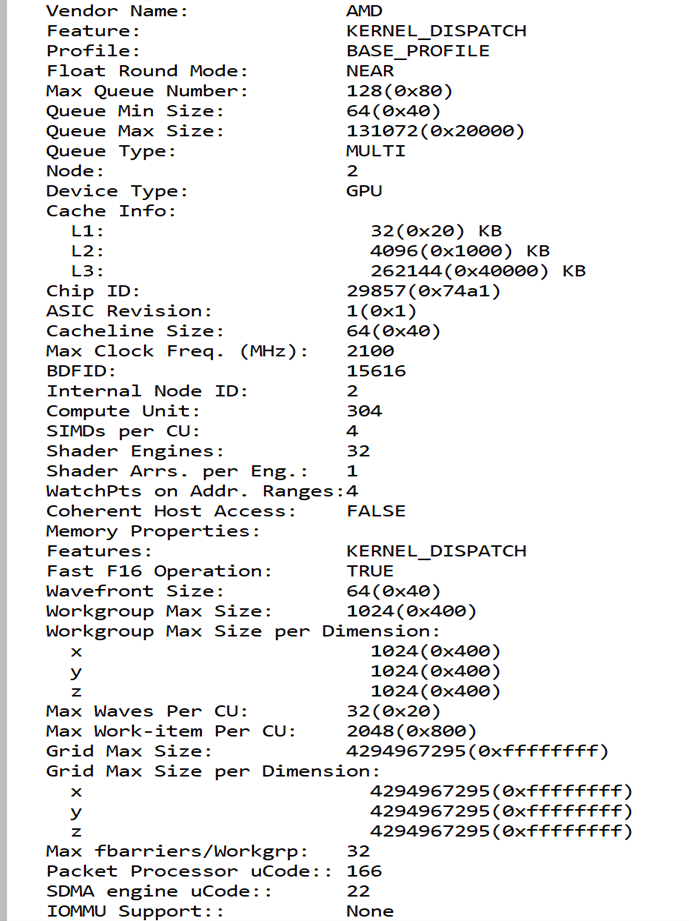

# Deepseek-R1 Chatbot on AMD GPU

Welcome to this hands-on workshop! In this section, we will set up a **Deepseek-R1 Chatbot** demo based on 1 **AMD GPU**. Through this workshop, you will learn how to leverage **vLLM** to fully utilize the **AMD GPU**'s strong AI computing capabilities and set up a personal **Deepseek-R1 Chatbot** on your laptop.

## Step 1: Access AMD GPU

In this workshop, we will use the **AMD GPU** cloud instance from Digital Ocean servers. Please access your GPU instance link, which has been provided by this workshop. 

Go to http://miaccess.embeddedllm.com and enter your name to get assigned for a GPU jupyter notebook session.

For myself, this instance has been assigned to me: [http://llmcluster.embeddedllm.com/user/80](http://llmcluster.embeddedllm.com/user/80).

After clicking it, you will find the below snapshot:


In this workshop, I will use the **Terminal** directly. After clicking **Terminal**, you need to use the command `rocm-smi` to check GPU status, like below:


The command `rocminfo` can list the information of the **AMD GPU**, like below:



Now you can enjoy the **AMD GPU**.

## Step 2: Launch vLLM server on AMD GPU

This cloud instance has a pre-installed AMD-optimized vLLM docker image ([https://hub.docker.com/r/rocm/vllm/tags](https://hub.docker.com/r/rocm/vllm/tags)), which provides an out-of-the-box experience for AMD vLLM users.

Launching a vLLM server is also very easy, just one command:

```bash
vllm serve deepseek-ai/DeepSeek-R1-Distill-Qwen-32B \
    --host 0.0.0.0 \
    --port 8000 \
    --api-key abc-123 \
    --seed 42
````

Here, we need to configure the port number according to the current network environment settings. For Hot Isle servers, port `8000` is open to customers to launch the vLLM server.
The `api-key` is also defined by yourself. In this example, we define it as `abc-123`. 

Once you see the below information, that means your vLLM server has been launched successfully:


You can test if the vLLM server works from your laptop.

In your laptop's command prompt, input the command with the obtained IP address (replace the example URL with your specific one):

```bash
curl http://llmcluster.embeddedllm.com/serve/1/v1/models -H "Authorization: Bearer abc-123"
```

If you see the below output, that means your vLLM server on the **AMD GPU** has been set up successfully:


## Step 3: Setup Open-WebUI

**Open WebUI** is an extensible, feature-rich, and user-friendly self-hosted AI platform designed to operate entirely offline. It supports various LLM inference frameworks, like **vLLM** and **OpenAI-compatible APIs**, making it a powerful AI deployment solution. In this workshop, we use it to set up our own Chatbot.

You can install the **Open-WebUI** server on your laptop.

According to the Open-WebUI documentation, the latest Open-WebUI depends on **Python 3.11**. Related modules in **Python 3.12** might not be fully compatible with the versions required by Open WebUI. So it is strongly recommended to use a **Python 3.11** environment on your laptop.

Python 3.11/Miniconda3 can be downloaded from these links:

1.  **Windows:** [https://repo.anaconda.com/miniconda/Miniconda3-py311\_23.10.0-1-Windows-x86\_64.exe](https://repo.anaconda.com/miniconda/Miniconda3-py311_23.10.0-1-Windows-x86_64.exe)
2.  **MacOS (x86):** [https://repo.anaconda.com/miniconda/Miniconda3-py311\_23.10.0-1-MacOSX-x86\_64.sh](https://repo.anaconda.com/miniconda/Miniconda3-py311_23.10.0-1-MacOSX-x86_64.sh)
3.  **MacOS (ARM):** [https://repo.anaconda.com/miniconda/Miniconda3-py311\_23.10.0-1-MacOSX-arm64.sh](https://repo.anaconda.com/miniconda/Miniconda3-py311_23.10.0-1-MacOSX-arm64.sh)

*(Note: The original guide linked to Python 3.12 installers despite recommending 3.11. The links above are for Miniconda with Python 3.11).*

We can take Windows OS as an example. By clicking the downloaded file, you begin to install Python 3.11/Miniconda3 on your laptop:


Once the **Python 3.11** environment on your laptop is ready, you can open the **Anaconda PowerShell Prompt** (or your preferred terminal if Miniconda is added to PATH) and run the below commands to install **Open-WebUI**:

```bash
# Ensure pip is available and up-to-date (optional but good practice)
# curl [https://bootstrap.pypa.io/get-pip.py](https://bootstrap.pypa.io/get-pip.py) -o get-pip.py
# python get-pip.py

pip install open-webui
```


The whole procedure to install **Open-WebUI** may take some time, feel free to take a break.

Once it is done, you can launch the **Open-WebUI** server as below. On your laptop, the port number is determined by yourself. The **Open-WebUI** default port is `8080`, but you can choose another value (e.g., `5009`).

```bash
open-webui serve --port {PORT_NUM}
```

In my test, I launched it like the snapshot below (using port `5009`):


If you encounter the following warning (e.g., Windows Firewall), please accept it to allow network connection for the **Open-WebUI** server:


Once you see the below output, the **Open-WebUI** server has been launched successfully:


## Step 4: Configure Open-WebUI client and run Chatbot

You can open the **Open-WebUI** client by accessing the Open-WebUI server IP address + server port number from your browser, like `http://<Server IP>:<Server Port>/`.

If you installed the **Open-WebUI** server on your laptop, you can usually access it using `localhost` directly, for example: `http://localhost:5009/` (if you used port `5009`).

When you first log in to the **Open-WebUI** client, you may need to register with a username, email, and password. Once logged in successfully, you need to configure your vLLM endpoint URL in the Open WebUI client as follows:

  * Navigate to **Settings** (usually a gear icon) as shown in the image below:

    

  * Select **Connections** from the left tab.

  * Enter the **Connection URL** that matches this format: `http://YOUR_VLLM_SERVER_PUBLIC_IP:PORT_NUMBER/v1`. For this workshop example: `http://llmcluster.embeddedllm.com/serve/1/v1`

  * Enter the **API Key** matching the key you chose in Step 2 (e.g., `abc-123`).

  * Enter the **Model name(s)** that exactly match the model identifier passed to `vllm serve` in Step 2 (e.g., `deepseek-ai/DeepSeek-R1-Distill-Qwen-32B`). You might need to type it in the "Model" field and press Enter or click an add button.

  * Click the **+** button or equivalent to add the model configuration if necessary.

  * Click the **Save** button.

    

In my demo, I configured it with the following settings:


When the configuration is saved, navigate back to the main chat interface. You should now be able to select the `deepseek-ai/DeepSeek-R1-Distill-Qwen-32B` model and start chatting. The Chatbot has been set up on your laptop successfully, with the AMD **GPU** on the cloud instance providing powerful **DeepSeek-R1** inference through **vLLM**\!


